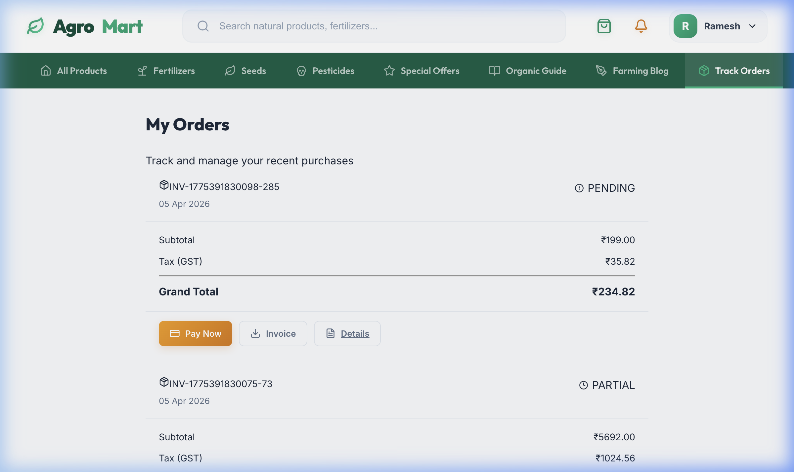

# 🌱 AgroMart: Comprehensive ERP & Store Management System

[](https://reactjs.org/)
[](https://nodejs.org/)
[](https://www.postgresql.org/)
[](https://vitejs.dev/)

> A high-end, nature-inspired ERP solution designed for agricultural retail and industrial supply chain management. Developed to professionalize offline agricultural stores with advanced financial, inventory, and analytics operations.

---

## 👨‍💻 Project Identity
- **Author**: Meetvirugama
- **Institution**: **DA-IICT** (Dhirubhai Ambani Institute of Information and Communication Technology)
- **Topic**: Modernized ERP for Offline Agricultural Stores

---

## 🖼️ Visual Gallery

### 🏠 Public Storefront
The storefront features a "Digital Forest" aesthetic with smooth gradients and a professional product grid.


### 🚜 Product Discovery & Cart
High-performance product listing with real-time stock status and a persistent slide-out cart for seamless shopping.
| Products Listing | Interactive Cart Drawer |
| :--- | :--- |
|  |  |

### 🔐 Authentication & Profile
A secure portal featuring OTP verification, Google OAuth, and personalized customer profiles with spend tracking.
| Secure Login | Customer Profile |
| :--- | :--- |
|  |  |

### 📦 Order Management
Full-lifecycle order tracking with real-time status updates and PDF invoice access.


### 📊 Admin Control Center (Command Center)
Powerful administrative tools including real-time revenue analytics and granular inventory management.
| Revenue Analytics | Inventory Management |
| :--- | :--- |
|  |  |

---

## 🚀 Key Services & Technical Solutions

### 💎 Financial Core Service
- **Atomic Transactions**: Orders, inventory updates, and ledger entries are executed within a single SQL transaction ensuring 100% data integrity.
- **GST Logic Engine**: Automatic calculation of 18% GST, internally split into **CGST (9%)** and **SGST (9%)** for accurate tax reporting.
- **Dynamic Discount Engine**: Real-time pricing adjustments from **5% to 15%** triggered by order volume thresholds.
- **Payment Lifecycle**: Full **Razorpay** integration with automated webhook verification and payment receipt generation.

### 📦 Inventory & Logistics Service
- **Double-Entry Ledger**: Every stock change is double-logged as an `IN/OUT` event with parent reference IDs.
- **Low Stock Sentinel**: Hard-coded safety thresholds (20 units) that trigger immediate visual alerts and reordering notifications.
- **Supplier Sourcing**: Direct linking of products to verified suppliers for streamlined procurement.

### 📊 Data Intelligence Service
- **Revenue Analytics**: Monthly trend analysis and growth percentage calculations via raw SQL reporting.
- **Customer CLV**: Spend-based ranking (VIP/NEW/DUE) to identify top agricultural partners.
- **Funnel Analysis**: Tracking conversion metrics from product view to payment success.

### 📩 Communication & Utility Service
- **OTP Security**: 6-digit email verification with strict 10-minute session TTL.
- **Invoice Engine**: Server-side PDF generation of professional industrial invoices stored in a secure cloud bucket or local storage.

---

## 📂 Project Architecture

```text
.
├── client/                 # Frontend (React + Vite)
│   ├── src/
│   │   ├── components/     # High-end UI Components (Cart, Layout, Common)
│   │   ├── pages/          # Shop, Admin, & Auth Views
│   │   ├── store/          # Zustand State (Auth, Cart, Toast)
│   │   └── services/       # Axios API Gateways
├── server/                 # Backend (Node.js + Express)
│   ├── src/
│   │   ├── controllers/    # API Request Handlers
│   │   ├── services/       # Core Brain (Order, Report, Inventory logic)
│   │   ├── models/         # Sequelize Postgres Schema
│   │   └── routes/         # REST API Endpoints
├── database/               # SQL Schemas, Migrations & Deep Seed Data
├── docs/                   # Diagrams & Persistent Screenshots
└── scripts/                # Sync & Maintenance Utilities
```

---

## 🏁 Getting Started

1. **Clone the repository**:
   ```bash
   git clone https://github.com/Meetvirugama/OfflineStoreWebsite.git
   ```
2. **Install Dependencies**:
   ```bash
   npm install && cd client && npm install && cd ../server && npm install
   ```
3. **Configure Environment**:
   Create a `.env` in the `server/` directory with your `DB_NAME`, `DB_PASSWORD`, and `GOOGLE_CLIENT_ID`.
4. **Run the Engine**:
   ```bash
   npm run dev
   ```

---

Developed with ❤️ by **Meetvirugama** at **DA-IICT**.
