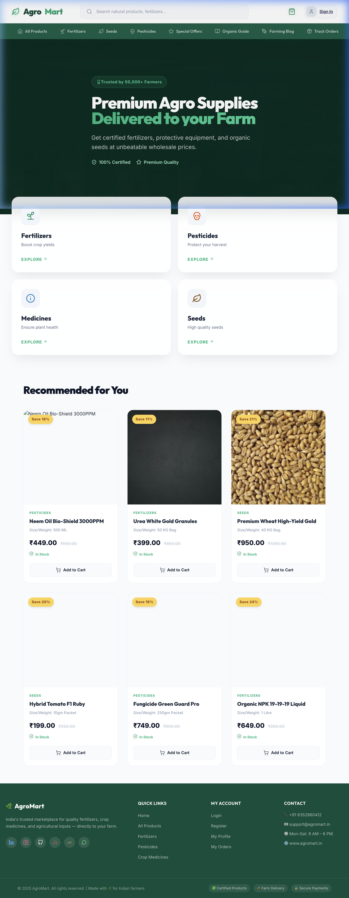
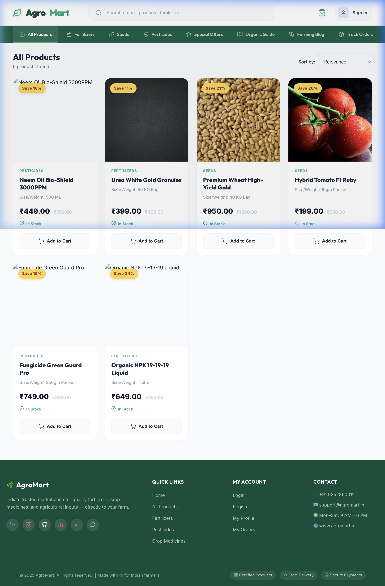
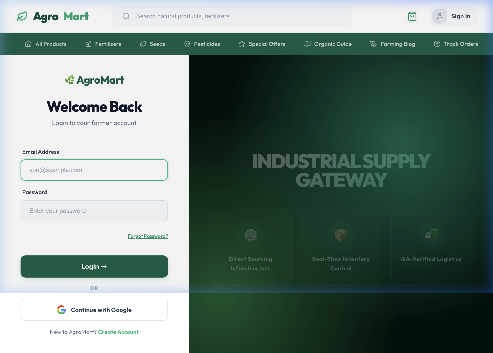
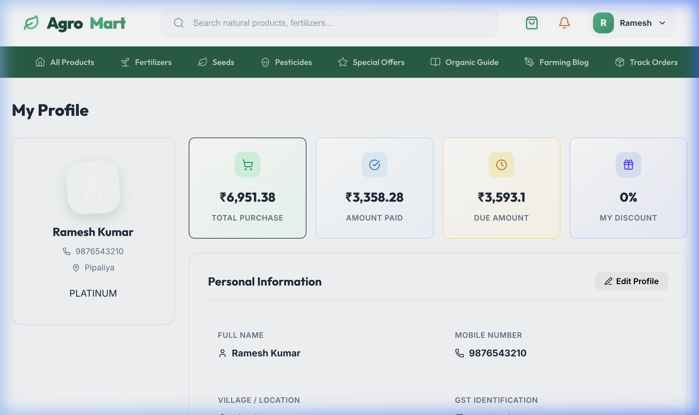
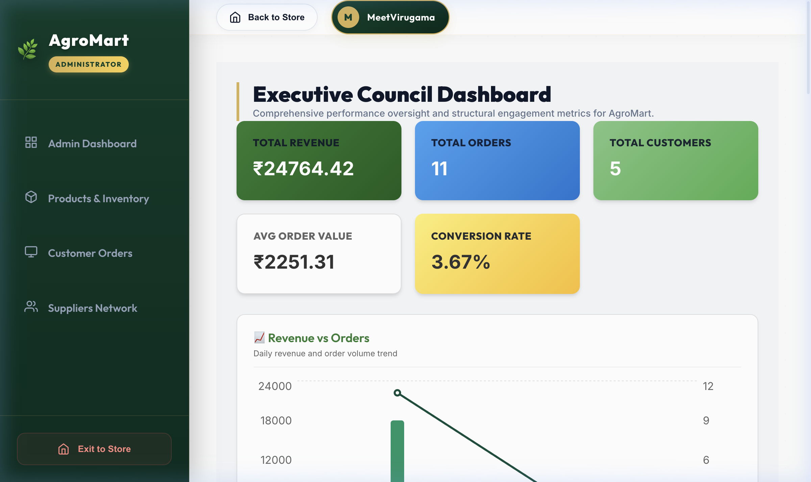
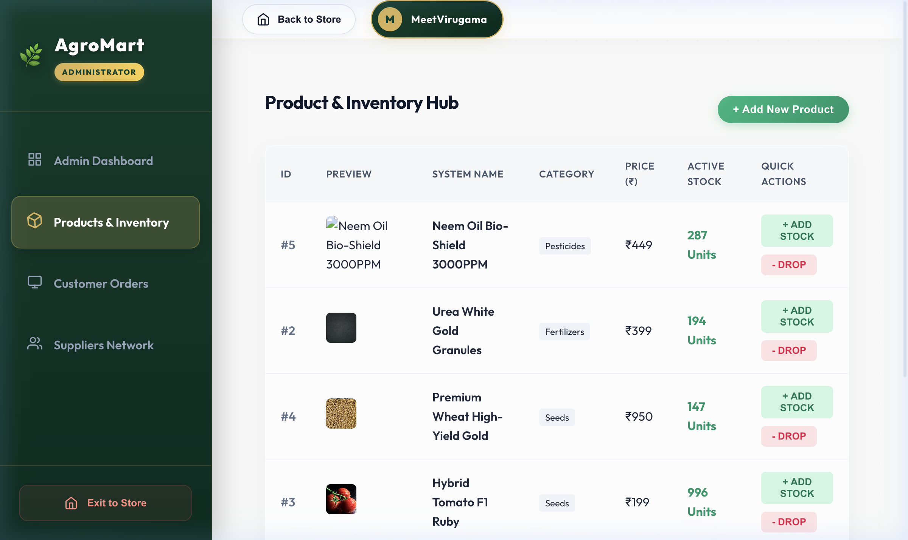

# 🏪 AgroMart: Independent Offline Store ERP System

[](https://reactjs.org/)
[](https://nodejs.org/)
[](https://www.postgresql.org/)
[](https://vitejs.dev/)

> **A highly scalable, production-ready ERP system designed explicitly for offline stores. Built with an independent-instance architecture, the system is engineered to be deployed individually for different physical stores, each provisioned with its own dedicated cloud infrastructure, database, and domain name.**

*The current implementation showcases **AgroMart**, a high-end, nature-inspired instance fully customized for the agricultural supply chain and retail sector.*

---

## 👨‍💻 Project Identity & Academic Context
- **Developer**: Meetvirugama
- **Institution**: **DA-IICT** (Dhirubhai Ambani Institute of Information and Communication Technology)
- **Course**: B.Tech (ICT) Project
- **Domain**: Enterprise Resource Planning (ERP), Cloud Infrastructure, Offline-to-Digital Business Transformation.

---

## 🎨 Aesthetic & Design Language
The platform utilizes a **"Living Digital Forest"** and **"Sun-Drenched Forest"** gradient identity, featuring the elegant **Comfortaa** font. It emphasizes modern UI/UX with CSS-driven micro-animations (e.g., leaf sprout effects) and a centralized notification strategy, completely replacing standard browser popups with beautiful, custom-branded UI components.

## 🖼️ Visual Gallery

### 🏠 Public Storefront & Product Discovery
A high-performance product browsing grid crafted for an organic, smooth shopping experience.
| Home Page | Products Grid |
| :--- | :--- |
|  |  |

### 🛒 Real-Time Cart & Checkout
An interactive side-drawer cart calculating tiered volume discounts and dynamic intrastate GST in real-time.


### 🔐 Secure Multi-Role Portal
State-of-the-art gateway providing robust Google OAuth 2.0 integration alongside secure 6-digit OTP fallbacks.
| Login Gateway (OAuth + OTP) | Customer Profile |
| :--- | :--- |
|  |  |

### 📊 Admin Intelligence & ERP Insights
A powerful administrative dashboard displaying financial analytics, inventory health, and order lifecycles with pixel-perfect accuracy.
| Analytics Dashboard | Inventory Management |
| :--- | :--- |
|  |  |

---

## 🚀 Enterprise Features & Technical Specifications

### 💎 Financial & Checkout Engine
- **Atomic SQL Transactions**: Ensures database integrity using Sequelize operations—all inventory deductions and ledger adjustments succeed or fail simultaneously.
- **Smart Taxation**: Automatic calculation of **18% GST** (split into 9% CGST and 9% SGST).
- **Automated Tiered Discounts**: Volume-based discounts automatically trigger based on cart subtotal (e.g., >₹2k: 5%, >₹5k: 10%, >₹10k: 15%).
- **Unlimited Customer Procurement**: Credit limit restrictions have been completely eliminated to support high-volume, unrestricted bulk orders.
- **Payment Gateway**: Integrated with **Razorpay SDK** for secure, checksum-verified digital transactions.

### 📦 Inventory & Operations
- **Dual-Entry Supply Chain Ledger**: Stock movements are accurately tracked via `IN`/`OUT` actions with exact references to purchases and sales.
- **Low-Stock Sentinel**: Automated health monitoring flags inventory dipping below a **20-unit threshold** within the admin interface.
- **PDF Invoicing**: Server-side generation of professional PDF invoices securely archived in `server/storage/invoices/`.

### 📊 Data Intelligence & Dashboard
- **Revenue Analytics**: Real-time aggregation of sales metrics and business growth visualization via **Recharts**.
- **Customer Lifetime Value (CLV)**: Dynamic ranking models tracking cumulative spends to categorize top-tier retail partners.
- **Custom Dashboard UI**: Advanced layout and design consistency, seamlessly integrating custom modals and toasts.

### 📩 Communications & Security
- **Automated Email Lifecycles**: Comprehensive transactional communications powered by **Nodemailer** (Welcome emails, Order Confirmations, active Payment Reminders, and Invoice Deliveries).
- **Authentication**: Stateless Role-Based Access Control (RBAC) via **JWT**, augmented with **Google OAuth 2.0** verification and OTP systems.

### 🌱 Smart Agriculture Intelligence (Agri-Intel)
- **Predictive Asset Velocity**: Real-time market telemetry tracking daily modal prices and volatility indices for over 12+ major crop categories.
- **Neuro-Analytics Outlook**: AI-powered "Bullish/Bearish" market indicators with automated confidence scoring for crop assets.
- **Adaptive Crop Profiles**: High-fidelity botanical data hub with floating magazine layouts, providing spacing geometries, photoperiod requirements, and harvesting windows.
- **JSONB Caching Engine**: High-performance local caching of external API telemetry (GrowStuff, Agmarknet) to minimize latency and external dependency costs.
- **Farming News & Announcements**: A specialized intelligence hub featuring automated NewsAPI integration with strict recursive filtering for 100% farming-related content.
- **Govt Scheme Sentinel**: Automatic identification and high-priority highlighting of government policies, subsidies, and "Yojanas" to keep farmers informed of critical state support.
- **Voice-Enabled Accessibility**: Native Web Speech API integration for text-to-speech news reading, optimized for field accessibility.


### 🌦️ Weather Command Center
- **Synoptic Telemetry**: Integration with **OpenWeather OneCall 3.0** for real-time temperature, 48-hour predictive trends, and 8-day outlooks.
- **Triple-Mode Geolocation**: Precision tracking via high-resolution GPS, intelligent IP-fallback, and village-level manual search.
- **Growth Indicators**: Specialized farming intelligence triggering alerts for Heat Stress, Irrigation pausing (Rain detection), and Pest Risk (High Humidity).
- **Interactive Visuals**: Glassmorphism dashboard with glass-glow effects and dynamic Recharts-powered climate telemetry.

---

## 📂 System Architecture

```text
.
├── client/                 # Frontend Environment (React 19 + Vite + Zustand)
│   ├── src/
│   │   ├── components/     # Reusable UI, Modals, custom notification Toasts
│   │   ├── store/          # Zustand Global State (Auth, Cart, Async Flow)
│   │   └── styles/         # CSS & Living Forest Themes
├── server/                 # Backend Environment (Node.js + Express)
│   ├── src/
│   │   ├── controllers/    # API Request Management & Validations
│   │   ├── services/       # Core Business Logic (Transactions, Mailers)
│   │   ├── models/         # Relational Postgres Schemas (Sequelize)
│   │   └── middlewares/    # Security, Validations & RBAC pipelines
├── database/               # SQL Schemas, Configuration files, Seeders
├── docs/                   # Visual Gallery Assets & Artifacts
└── infrastructure/         # Deployment templates (Isolated Instances)
```

---

## 🏁 Deployment & Configuration

Designed for scalability, this ERP employs isolated infrastructure deployment. Every new physical store receives its own dedicated, private clone of this environment.

### 1. Requirements
- **Node.js**: v18+
- **PostgreSQL**: v14+
- **Google Cloud Console**: Active Client ID & Secret for OAuth.
- **Razorpay**: Production/Test API credentials.

### 2. Environment Variables (`server/.env`)
```env
# Database Configuration (Cloud Supabase)
DATABASE_URL=your_supabase_connection_string

# Security & Sessions
JWT_SECRET=your_jwt_signing_key
GOOGLE_CLIENT_ID=your_oauth_client_id
GOOGLE_CLIENT_SECRET=your_oauth_client_secret

# Third-Party Integrations
RAZORPAY_KEY=your_rzp_key
RAZORPAY_SECRET=your_rzp_secret
EMAIL=store_instance@gmail.com
EMAIL_PASS=your_app_password

# Deployment (Vercel Integration)
FRONTEND_URL=https://your-project.vercel.app
VITE_API_URL=https://your-api-server.com/api
```

### 3. Execution
```bash
# 1. Install workspace dependencies
npm install

# 2. Launch Client & Server concurrently
npm run dev
```

---

*Engineered with precision for performance, aesthetics, and robust scale. Developed by **Meetvirugama** at **DA-IICT**, Gandhinagar.*
